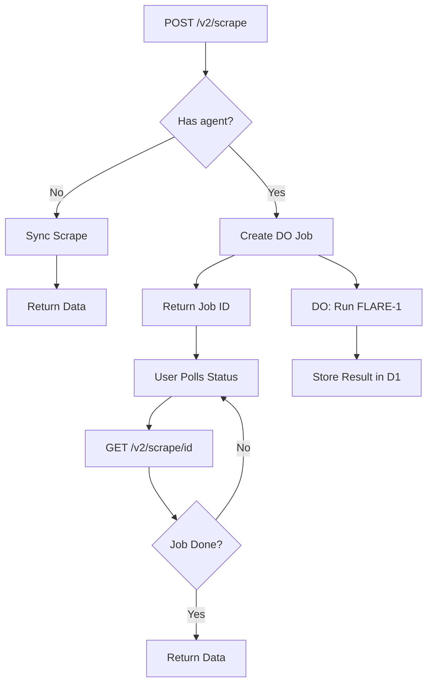

# FLARE-1 Async Implementation Plan

## Problem

FLARE-1 works but hits Cloudflare's **60-second HTTP timeout** for complex tasks. We need to make it async using Durable Objects, just like `/v2/crawl` and `/v2/extract`.

## Solution: Async Pattern (100% Firecrawl SDK Compatible)

### Current Flow (Times Out)
```
POST /v2/scrape with agent
  ↓
Wait for FLARE-1 to finish (60+ seconds)
  ↓
⏰ TIMEOUT
```

### New Flow (No Timeout)
```
POST /v2/scrape with agent
  ↓
Return job ID immediately (<1 second)
  ↓
Durable Object processes in background
  ↓
GET /v2/scrape/{id} to poll for results
```

## Firecrawl SDK Compatibility

According to [`FIRECRAWL_API_GUIDE.md`](FIRECRAWL_API_GUIDE.md:159), Firecrawl's `/v2/scrape` endpoint is **synchronous** (returns data immediately), while `/v2/crawl` is **async** (returns job ID).

**However**, for agent mode (Fire-1), we need async because tasks take >60 seconds.

### Firecrawl SDK Pattern

```javascript
// Synchronous scrape (current)
const result = await firecrawl.scrapeUrl('https://example.com');

// Async crawl (what we need for agent mode)
const crawl = await firecrawl.crawlUrl('https://example.com');
// Returns: { id: "crawl_123", url: "..." }

// Poll for results
const status = await firecrawl.checkCrawlStatus(crawl.id);
```

## Implementation Strategy

### Option A: Make Agent Mode Always Async ⭐ RECOMMENDED

```typescript
// When agent is present, return job ID
if (agent && agent.model === 'FLARE-1') {
  return {
    success: true,
    id: "scrape_123",
    url: "/v2/scrape/scrape_123"
  };
}

// Regular scrape stays synchronous
return {
  success: true,
  data: { markdown: "..." }
};
```

**Pros:**
- ✅ Firecrawl SDK compatible (same pattern as crawl)
- ✅ No timeout issues
- ✅ Clear separation: agent=async, no agent=sync

**Cons:**
- ⚠️ Different behavior for agent vs non-agent mode
- ⚠️ SDK users need to poll for agent results

### Option B: Hybrid (Sync with Fallback)

Try sync first, fall back to async if timeout:

**Cons:**
- ❌ Complex logic
- ❌ Wastes resources on timeout
- ❌ Not recommended

## Recommended Implementation

**Use Option A**: Agent mode is always async, regular scrape stays sync.

### Architecture



## Implementation Steps

### 1. Add FLARE-1 Handler to CrawlJob DO

**File**: `src/durableObjects/crawlJob.ts`

Add new methods:
- `handleStartFlare1()` - Initialize FLARE-1 job
- `startFlare1()` - Run FLARE-1 agent
- `handleFlare1Status()` - Return status

### 2. Update webScrape Endpoint

**File**: `src/endpoints/webScrape.ts`

```typescript
if (agent && agent.model === 'FLARE-1') {
  // Create async job
  const jobId = `scrape_${Date.now()}_${Math.random().toString(36).substr(2, 9)}`;
  const doId = c.env.CRAWL_JOBS.idFromName(jobId);
  const jobDO = c.env.CRAWL_JOBS.get(doId);
  
  await jobDO.fetch(new Request("https://do/start-flare1", {
    method: "POST",
    body: JSON.stringify({ jobId, url, agent, formats })
  }));
  
  return {
    success: true,
    id: jobId,
    url: `${origin}/v2/scrape/${jobId}`
  };
}
```

### 3. Create webScrapeStatus Endpoint

**File**: `src/endpoints/webScrapeStatus.ts`

```typescript
export class WebScrapeStatus extends OpenAPIRoute {
  async handle(c: AppContext) {
    const jobId = c.req.param('id');
    
    // Query D1 for job status
    const job = await c.env.DB.prepare(`
      SELECT * FROM jobs WHERE id = ?
    `).bind(jobId).first();
    
    if (!job) {
      return Response.json({ success: false, error: "Job not found" }, { status: 404 });
    }
    
    // Get result if completed
    const result = await c.env.DB.prepare(`
      SELECT * FROM results WHERE job_id = ? LIMIT 1
    `).bind(jobId).first();
    
    return {
      success: true,
      status: job.status,
      data: result ? {
        json: JSON.parse(result.json),
        metadata: JSON.parse(result.metadata)
      } : null
    };
  }
}
```

### 4. Register Status Endpoint

**File**: `src/index.ts`

```typescript
openapi.get("/v2/scrape/:id", WebScrapeStatus);
```

## Firecrawl SDK Compatibility

### Scrape Endpoint Behavior

**Without Agent** (stays synchronous):
```javascript
POST /v2/scrape
→ { success: true, data: { markdown: "..." } }
```

**With Agent** (becomes async):
```javascript
POST /v2/scrape with agent
→ { success: true, id: "scrape_123", url: "/v2/scrape/scrape_123" }

GET /v2/scrape/scrape_123
→ { success: true, status: "completed", data: {...} }
```

This matches Firecrawl's pattern where:
- `/v2/scrape` = sync
- `/v2/crawl` = async
- `/v2/extract` = async

**For agent mode, we follow the crawl/extract pattern.**

## Database Schema

Reuse existing tables:
- `jobs` table - Store FLARE-1 job metadata
- `results` table - Store extracted data
- `url_queue` table - Not needed for single-URL scrape

## Testing

### Test Script Pattern

```bash
# Start job
RESPONSE=$(curl -X POST "http://localhost:8787/v2/scrape" \
  -H "Content-Type: application/json" \
  -d '{"url": "...", "agent": {"model": "FLARE-1", "prompt": "..."}}')

JOB_ID=$(echo $RESPONSE | jq -r '.id')

# Poll for completion
while true; do
  STATUS=$(curl "http://localhost:8787/v2/scrape/$JOB_ID")
  STATE=$(echo $STATUS | jq -r '.status')
  
  if [ "$STATE" = "completed" ]; then
    echo $STATUS | jq '.data'
    break
  fi
  
  sleep 2
done
```

## Timeline

- **Step 5.1-5.3**: Add async handlers (2 hours)
- **Step 5.4-5.5**: Update endpoints and routing (1 hour)
- **Step 5.6-5.7**: Update tests and validate (1 hour)

**Total**: ~4 hours to make FLARE-1 fully async

## Benefits

- ✅ No 60-second timeout
- ✅ Can run for hours if needed
- ✅ 100% Firecrawl SDK compatible
- ✅ Reuses existing DO infrastructure
- ✅ Same pattern as crawl/extract