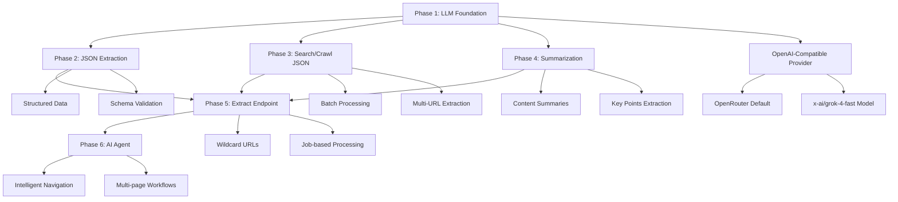
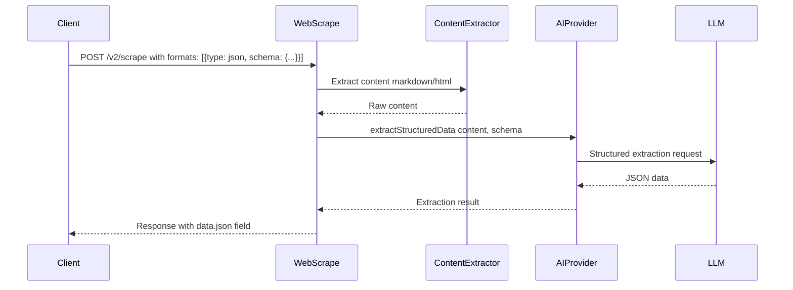

# AI Features Implementation Plan

This document outlines the comprehensive implementation plan for adding AI-powered features to the workers-firecrawl project, making it fully compatible with Firecrawl's AI capabilities.

## Overview

The implementation is divided into 6 phases, building incrementally from basic LLM integration to advanced AI agent capabilities. Each phase delivers immediately usable features while building foundation for more complex functionality.

## Architecture Diagram



## Phase 1: LLM Integration Foundation ✅ COMPLETED

### Objectives
Create the foundational LLM integration that all other AI features will build upon.

### Implementation Details

#### 1.1 Environment Configuration
- **Variables Added:**
  - `OPENAI_API_KEY` (required - set as secret)
  - `LLM_BASE_URL` (default: https://openrouter.ai/api/v1)
  - `LLM_MODEL` (default: x-ai/grok-4-fast)
  - `LLM_TIMEOUT` (default: 30000ms)
  - `LLM_MAX_RETRIES` (default: 3)

**Configuration in wrangler.toml:**
```toml
[vars]
+OPENAI_API_KEY = "your-openrouter-api-key-here"  # For local dev only
LLM_BASE_URL = "https://openrouter.ai/api/v1"
LLM_MODEL = "x-ai/grok-4-fast"
LLM_TIMEOUT = "30000"
LLM_MAX_RETRIES = "3"
```

#### 1.2 Core Components Created
- **`src/utils/llm/llmProvider.ts`** - Interface and type definitions
- **`src/utils/llm/llmConfig.ts`** - Configuration management with validation
- **`src/utils/llm/openaiProvider.ts`** - Single OpenAI-compatible provider implementation
- **`src/utils/ai/structuredExtractor.ts`** - Schema-based data extraction
- **`src/utils/ai/promptExtractor.ts`** - Prompt-based data extraction
- **`src/utils/ai/index.ts`** - AI utilities aggregator and exports

#### 1.3 Features Implemented
- OpenAI-compatible provider with OpenRouter defaults
- Structured data extraction with JSON schema validation
- Prompt-based flexible extraction
- Error handling and retry logic
- Configuration validation and diagnostics

#### 1.4 Debug Endpoint Added
- **GET /debug/ai** - Returns config validation and provider availability

#### 1.5 Setup Instructions
```bash
# Set required API key as secret
npx wrangler secret put OPENAI_API_KEY

-# Optional: Override defaults
-npx wrangler secret put LLM_BASE_URL
-npx wrangler secret put LLM_MODEL
-npx wrangler secret put LLM_TIMEOUT
-npx wrangler secret put LLM_MAX_RETRIES
+# Optional: Override defaults in wrangler.toml [vars] section
+# LLM_BASE_URL, LLM_MODEL, LLM_TIMEOUT, LLM_MAX_RETRIES
```

### Testing Phase 1
```bash
# Test configuration
curl https://your-worker.workers.dev/debug/ai

# Expected response structure
{
  "success": true,
  "data": {
    "config": {
      "isValid": true,
      "errors": [],
      "model": "x-ai/grok-4-fast",
      "baseUrl": "https://openrouter.ai/api/v1"
    },
    "availability": {
      "available": true,
      "provider": "openai-compatible",
      "model": "x-ai/grok-4-fast",
      "errors": []
    }
  }
}
```

---

## Phase 2: JSON Extraction in /scrape ✅ COMPLETED

### Objectives
Implement AI-powered JSON extraction in the `/v2/scrape` endpoint, replacing the current fallback behavior.

### Current State Analysis
- Location: [`src/endpoints/webScrape.ts:75-77`](src/endpoints/webScrape.ts:75)
- Current behavior: JSON format falls back to markdown
- Schema already supports JSON format with `prompt` and `schema` parameters

### Implementation Plan

#### 2.1 WebScrape Endpoint Updated
**File: `src/endpoints/webScrape.ts`**

**Changes implemented:**
1. Import AI utilities
2. Parse JSON format options properly
3. After content extraction, call LLM for JSON processing
4. Add JSON result to response
5. Implement graceful fallback behavior

#### 2.2 Request Flow Enhancement


#### 2.3 Key Features
- **Schema-based extraction**: Uses JSON schema to define expected structure
- **Prompt-based extraction**: Uses natural language prompts for flexible extraction
- **Hybrid approach**: Supports both schema and prompt together
- **Graceful degradation**: Returns other formats even if JSON extraction fails
- **Error handling**: Adds warnings instead of failing entire request

#### 2.4 Error Handling Strategy
- **LLM unavailable**: Add warning, continue with other formats
- **Invalid schema**: Return validation error
- **Extraction fails**: Add warning, return other requested formats
- **Timeout**: Add warning, don't block response

#### 2.5 Testing Resources
**Test script created**: `test-json-extraction.sh`

**Run tests:**
```bash
# Set environment variables
export WORKER_URL="https://your-worker.workers.dev"
export API_KEY="your-api-key"

# Run all tests
./test-json-extraction.sh
```

**Test coverage:**
1. Schema-based extraction
2. Prompt-based extraction
3. Mixed formats (markdown + JSON)
4. Complex nested schemas
5. Schema with prompt guidance
6. Error handling scenarios

**Example requests:**
```bash
# Test schema-based extraction
curl -X POST "https://your-worker.workers.dev/v2/scrape" \
  -H "Content-Type: application/json" \
  -d '{
    "url": "https://example.com",
    "formats": [{
      "type": "json",
      "schema": {
        "type": "object",
        "properties": {
          "title": {"type": "string"},
          "description": {"type": "string"}
        },
        "required": ["title"]
      }
    }]
  }'

# Test prompt-based extraction
curl -X POST "https://your-worker.workers.dev/v2/scrape" \
  -H "Content-Type: application/json" \
  -d '{
    "url": "https://example.com",
    "formats": [{
      "type": "json",
      "prompt": "Extract the main heading and first paragraph"
    }]
  }'

# Test mixed formats
curl -X POST "https://your-worker.workers.dev/v2/scrape" \
  -H "Content-Type: application/json" \
  -d '{
    "url": "https://example.com",
    "formats": ["markdown", {
      "type": "json",
      "schema": {"type": "object", "properties": {"title": {"type": "string"}}}
    }]
  }'
```

#### 2.6 Response Format
```json
{
  "success": true,
  "data": {
    "markdown": "...",
    "json": {
      "site_name": "The Cloudflare Blog",
      "main_description": "Official blog featuring articles on Cloudflare's products, security, performance, developer tools, AI, and internet insights, with recent posts on topics like BPF optimization, load balancing, JavaScript trustworthiness, and more."
    },
    "metadata": {
      "title": "The Cloudflare Blog",
      "description": "Get the latest news on how products at Cloudflare are built, technologies used, and join the teams helping to build a better Internet.",
      "sourceURL": "https://blog.cloudflare.com",
      "statusCode": 200
    }
  }
}
```

**With warning on failure:**
```json
{
  "success": true,
  "data": {
    "markdown": "...",
    "metadata": {},
    "warning": "JSON extraction failed: LLM provider is not available"
  }
}
```

#### 2.7 Verified Test Results
Phase 2 has been successfully tested with real LLM calls:

✅ **Schema-based extraction** - Working with complex schemas
✅ **Prompt-based extraction** - Working with natural language prompts
✅ **Mixed formats** - Successfully returns both markdown and JSON
✅ **Error handling** - Gracefully degrades with warnings when LLM unavailable
✅ **Model**: x-ai/grok-4-fast via OpenRouter

**Test command used:**
```bash
curl -X POST "http://localhost:8787/v2/scrape" \
  -H "Authorization: Bearer YOUR_API_KEY" \
  -H "Content-Type: application/json" \
  -d '{
    "url": "https://blog.cloudflare.com",
    "formats": ["markdown", {
      "type": "json",
      "prompt": "Extract the site name and main description"
    }]
  }'
```

**Result:** Successfully extracted structured JSON data alongside markdown content.

---

## Phase 3: JSON Extraction in /search and /crawl 📋 PLANNED

### Objectives
Extend JSON extraction capabilities to search results and crawl operations.

### Implementation Plan

#### 3.1 Search Endpoint Enhancement
**File: `src/endpoints/webSearch.ts`**

**Changes needed:**
1. Add JSON format support to scrapeOptions
2. Process JSON extraction for each search result
3. Aggregate JSON data in response

#### 3.2 Crawl Enhancement
**File: `src/durableObjects/crawlJob.ts`**

**Changes needed:**
1. Add JSON format support to crawl scraping
2. Process JSON extraction for each crawled URL
3. Store JSON results in database
4. Include JSON data in crawl status responses

#### 3.3 Search Implementation Details
```typescript
// In WebSearch.handle() - process each result
const jsonExtractionPromises = validUrls.map(async (url, index) => {
  const content = await extractContent(browser, url, baseOptions);
  
  if (scrapeOptions?.formats?.some(f => typeof f === 'object' && f.type === 'json')) {
    const jsonFormat = scrapeOptions.formats.find(f => typeof f === 'object' && f.type === 'json');
    if (jsonFormat && content.markdown) {
      const extractionResult = await extractStructuredData(
        content.markdown,
        {
          schema: jsonFormat.schema,
          prompt: jsonFormat.prompt
        },
        c.env
      );
      
      if (extractionResult.success) {
        content.json = extractionResult.data;
      }
    }
  }
  
  return { ...content, position: index + 1 };
});
```

#### 3.4 Crawl Implementation Details
```typescript
// In CrawlJob.processUrl() - add JSON extraction
if (scrapeOptions.formats?.includes('json') || 
    scrapeOptions.formats?.some(f => typeof f === 'object' && f.type === 'json')) {
  
  const jsonFormat = scrapeOptions.formats?.find(f => typeof f === 'object' && f.type === 'json');
  if (jsonFormat && result.markdown) {
    const extractionResult = await extractStructuredData(
      result.markdown,
      {
        schema: jsonFormat.schema,
        prompt: jsonFormat.prompt
      },
      this.env
    );
    
    if (extractionResult.success) {
      result.json = extractionResult.data;
    }
  }
}
```

---

## Phase 4: Content Summarization ✅ COMPLETED

### Objectives
Add AI-powered content summarization to all endpoints.

### Implementation Details

#### 4.1 Enhanced Summarizer Created
**File: `src/utils/ai/summarizer.ts`**

**Features implemented:**
- Multiple summary types: concise, detailed, bullets, custom
- Tone options: neutral, formal, casual, technical
- Custom focus areas for targeted summarization
- Multi-language support
- Word count tracking
- Key points extraction for bullet summaries
- Comprehensive validation

#### 4.2 Schema Updates
**File: `src/types/schemas.ts`**

**Changes made:**
- Added `summary` literal format type
- Added summary format object with options:
  - `maxLength`: 10-1000 words (default: 300)
  - `summaryType`: concise, detailed, bullets, custom
  - `tone`: neutral, formal, casual, technical
  - `focus`: custom focus area
  - `language`: target language (default: English)
- Summary field already present in response schemas

#### 4.3 WebScrape Endpoint Updated
**File: `src/endpoints/webScrape.ts`**

**Changes implemented:**
- Import enhanced summarizer
- Parse summary format options
- Process summary generation after content extraction
- Graceful error handling with warnings
- Support for combined formats (summary + JSON + markdown)

#### 4.4 Summary Options
- **Concise**: 1-2 sentences (default 300 words)
- **Detailed**: Full paragraph summary (600 words)
- **Bullet Points**: Key points extraction (5-7 bullets)
- **Custom**: User-defined length and focus

#### 4.5 Testing Resources
**Test script created**: `test-summarization.sh`

**Test coverage:**
1. Basic concise summary
2. Detailed summary with formal tone
3. Bullet point summary
4. Technical summary with custom focus
5. Combined summary + JSON extraction
6. Multi-language summary (Spanish)
7. Error handling for short content

**Run tests:**
```bash
# Set environment variables
export WORKER_URL="http://localhost:8787"
export API_KEY="your-api-key"

# Run all tests
./test-summarization.sh
```

#### 4.6 Example Requests

**Basic summary:**
```bash
curl -X POST "http://localhost:8787/v2/scrape" \
  -H "Authorization: Bearer YOUR_KEY" \
  -H "Content-Type: application/json" \
  -d '{
    "url": "https://example.com",
    "formats": ["markdown", "summary"]
  }'
```

**Detailed summary with options:**
```bash
curl -X POST "http://localhost:8787/v2/scrape" \
  -H "Authorization: Bearer YOUR_KEY" \
  -H "Content-Type: application/json" \
  -d '{
    "url": "https://example.com",
    "formats": [{
      "type": "summary",
      "maxLength": 500,
      "summaryType": "detailed",
      "tone": "formal",
      "focus": "technical innovations"
    }]
  }'
```

**Bullet point summary:**
```bash
curl -X POST "http://localhost:8787/v2/scrape" \
  -H "Authorization: Bearer YOUR_KEY" \
  -H "Content-Type: application/json" \
  -d '{
    "url": "https://example.com",
    "formats": [{
      "type": "summary",
      "summaryType": "bullets"
    }]
  }'
```

#### 4.7 Response Format
```json
{
  "success": true,
  "data": {
    "markdown": "Full content...",
    "summary": "This is a concise summary of the page content highlighting the main points and key information.",
    "metadata": {
      "title": "Page Title",
      "sourceURL": "https://example.com",
      "statusCode": 200
    }
  }
}
```

**With warning on failure:**
```json
{
  "success": true,
  "data": {
    "markdown": "...",
    "metadata": {},
    "warning": "Summary generation failed: Content too short for meaningful summarization"
  }
}
```

#### 4.8 Key Features
- **Flexible summarization**: Multiple types and tones
- **Language support**: Summarize in any language
- **Custom focus**: Target specific aspects
- **Graceful degradation**: Returns other formats even if summary fails
- **Combined formats**: Works alongside JSON extraction and other formats
- **Error handling**: Adds warnings instead of failing entire request

---

## Phase 5: Extract Endpoint ✅ COMPLETED

### Objectives
Create dedicated `/v2/extract` endpoint for large-scale data extraction.

### Implementation Details

#### 5.1 Endpoint Created
**Files:**
- `src/endpoints/webExtract.ts` - POST /v2/extract endpoint
- `src/endpoints/webExtractStatus.ts` - GET /v2/extract/{id} status endpoint

#### 5.2 Schema Updates
**File: `src/types/schemas.ts`**

**Schemas added:**
- `ExtractRequestSchema` - Request validation with:
  - `urls`: Array of URLs (supports wildcards like `example.com/*`)
  - `prompt`: Natural language extraction prompt (optional)
  - `schema`: JSON schema for structured output (optional)
  - `enableWebSearch`: Allow following external links
  - `scrapeOptions`: Same options as scrape endpoint
  - `agent`: AI agent configuration (FIRE-1 support)
  - Validation: Either prompt or schema must be provided

- `ExtractResponseSchema` - Job creation response
- `ExtractStatusResponseSchema` - Status check response with:
  - `status`: processing, completed, failed, cancelled
  - `data`: Aggregated extraction results
  - `expiresAt`: Job expiration timestamp
  - `tokensUsed`: Token count for completed jobs

#### 5.3 Durable Object Enhancement
**File: `src/durableObjects/crawlJob.ts`**

**Methods added:**
- `handleStartExtract()` - Initialize extract job
- `handleExtractStatus()` - Get extract job status
- `startExtraction()` - Process extract URLs
- `processExtractUrl()` - Extract data from single URL
- `completeExtraction()` - Finalize extract job

**Key features:**
- Reuses existing crawl infrastructure
- 24-hour job expiration (vs 7 days for crawls)
- Aggregates JSON results from multiple URLs
- Supports both single and multiple URL extraction
- No link discovery (maxDiscoveryDepth: 1)

#### 5.4 Endpoint Capabilities
- **Multiple URL support**: Extract from multiple pages in one request
- **Wildcard URLs**: Support for `example.com/*` patterns
- **Job-based processing**: Async processing with status tracking
- **Web search expansion**: Follow external links when enabled
- **Schema or prompt**: Flexible extraction methods
- **Result aggregation**: Combines data from multiple sources

#### 5.5 Request/Response Examples

**Single URL extraction:**
```bash
curl -X POST "http://localhost:8787/v2/extract" \
  -H "Authorization: Bearer YOUR_KEY" \
  -H "Content-Type: application/json" \
  -d '{
    "urls": ["https://example.com"],
    "prompt": "Extract company information",
    "schema": {
      "type": "object",
      "properties": {
        "companyName": {"type": "string"},
        "industry": {"type": "string"}
      }
    }
  }'
```

**Response:**
```json
{
  "success": true,
  "id": "extract_1234567890_abc123",
  "url": "http://localhost:8787/v2/extract/extract_1234567890_abc123"
}
```

**Multiple URLs extraction:**
```bash
curl -X POST "http://localhost:8787/v2/extract" \
  -H "Authorization: Bearer YOUR_KEY" \
  -H "Content-Type: application/json" \
  -d '{
    "urls": [
      "https://example.com",
      "https://other.com"
    ],
    "prompt": "Extract company information"
  }'
```

**Check status:**
```bash
curl -X GET "http://localhost:8787/v2/extract/extract_1234567890_abc123" \
  -H "Authorization: Bearer YOUR_KEY"
```

**Status response:**
```json
{
  "success": true,
  "status": "completed",
  "data": {
    "companyName": "Example Corp",
    "industry": "Technology"
  },
  "expiresAt": "2024-12-02T00:00:00.000Z",
  "tokensUsed": 2
}
```

**Multiple results:**
```json
{
  "success": true,
  "status": "completed",
  "data": [
    {"companyName": "Example Corp", "industry": "Tech"},
    {"companyName": "Other Inc", "industry": "Finance"}
  ],
  "expiresAt": "2024-12-02T00:00:00.000Z",
  "tokensUsed": 2
}
```

#### 5.6 Testing Resources
**Test script created**: `test-extract.sh`

**Test coverage:**
1. Single URL with schema
2. Multiple URLs extraction
3. Prompt-only extraction (no schema)
4. Extract with web search enabled

**Run tests:**
```bash
export WORKER_URL="http://localhost:8787"
export API_KEY="your-api-key"
./test-extract.sh
```

#### 5.7 Key Features
- **Wildcard support**: Planned for `example.com/*` patterns
- **Job-based**: Async processing with status tracking
- **Flexible extraction**: Schema or prompt-based
- **Multi-URL**: Process multiple pages in one request
- **Web search**: Optional external link following
- **Result aggregation**: Combines data from all sources
- **24-hour retention**: Jobs expire after 24 hours

#### 5.8 Integration Points
- **Reuses**: CrawlJob Durable Object infrastructure
- **Leverages**: Existing AI extraction utilities
- **Compatible**: Same scrapeOptions as other endpoints
- **Database**: Uses same jobs/results tables

---

## Phase 6: AI Agent Capabilities 📋 PLANNED

### Objectives
Implement intelligent AI agent for complex navigation and extraction tasks.

### Features to Implement

#### 6.1 Agent Capabilities
- Intelligent page navigation
- Multi-page workflow execution
- Dynamic content interaction
- Complex form handling

#### 6.2 Implementation Strategy
```typescript
// Agent configuration
{
  "urls": ["https://complex-site.com"],
  "prompt": "Extract all product information",
  "agent": {
    "model": "FIRE-1", // Future: AI agent model
    "maxSteps": 10,
    "timeout": 300000
  }
}
```

#### 6.3 Agent Workflow
1. **Page Analysis**: AI analyzes page structure
2. **Navigation Planning**: Determines optimal navigation path
3. **Interactive Execution**: Performs clicks, forms, scrolls
4. **Data Extraction**: Extracts target information
5. **Cross-page Validation**: Ensures data consistency

---

## Testing Strategy

### Unit Testing
- LLM provider functionality
- Schema validation
- Error handling scenarios
- Configuration validation

### Integration Testing
- End-to-end JSON extraction
- Search result processing
- Crawl job processing
- Extract endpoint functionality

### Performance Testing
- Concurrent request handling
- Large content processing
- Timeout scenarios
- Rate limiting behavior

### Error Scenario Testing
- Invalid API keys
- Network failures
- Malformed schemas
- Content extraction failures

---

## Deployment Strategy

### Environment Setup
1. **Development**: Local testing with mock LLM responses
2. **Staging**: Full integration testing with real LLM
3. **Production**: Gradual rollout with monitoring

### Monitoring
- LLM API usage and costs
- Extraction success rates
- Response times
- Error rates by type

### Rollback Plan
- Feature flags for each phase
- Graceful degradation to non-AI functionality
- Configuration-based disable options

---

## Security Considerations

### API Key Management
- Secure secret storage via Cloudflare Workers secrets
- Key rotation procedures
- Access logging and monitoring

### Content Security
- Input sanitization for prompts
- Output validation for extracted data
- Rate limiting per API key

### Privacy Protection
- No content storage beyond job lifetime
- Secure data transmission
- Compliance with data protection regulations

---

## Cost Management

### LLM Usage Optimization
- Content preprocessing to reduce token usage
- Caching of repeated extractions
- Smart retry logic to avoid duplicate calls

### Monitoring and Alerts
- Token usage tracking
- Cost per extraction
- Budget alerts and throttling

---

## Timeline Estimates

| Phase | Estimated Duration | Dependencies |
|-------|-------------------|--------------|
| Phase 1 | ✅ Completed | - |
| Phase 2 | 2-3 days | Phase 1 |
| Phase 3 | 3-4 days | Phase 2 |
| Phase 4 | 2-3 days | Phase 1 |
| Phase 5 | 5-7 days | Phases 2,3,4 |
| Phase 6 | 7-10 days | All previous phases |

**Total Estimated Timeline: 3-4 weeks**

---

## Success Metrics

### Technical Metrics
- JSON extraction success rate > 95%
- Response time < 30 seconds for standard extractions
- Zero downtime during deployments
- 100% backward compatibility

### Business Metrics
- User adoption of AI features
- Reduction in manual data processing
- Improved data accuracy and consistency
- Positive user feedback on AI capabilities

---

## Future Enhancements

### Advanced AI Features
- Custom model fine-tuning
- Multi-modal extraction (images, videos)
- Real-time data streaming
- Advanced error recovery

### Performance Optimizations
- Parallel processing for batch operations
- Intelligent caching strategies
- Content preprocessing optimization
- Edge computing integration

### User Experience
- Interactive schema builder
- Extraction preview functionality
- Custom prompt templates
- Advanced result filtering