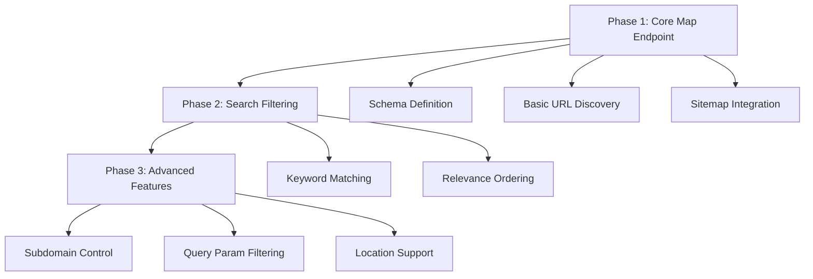
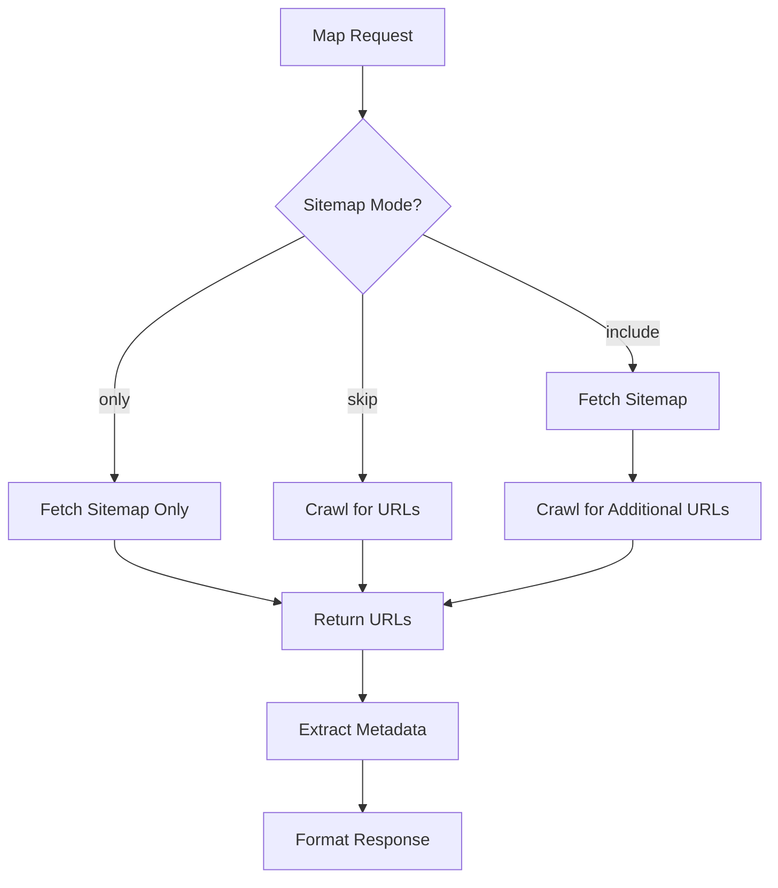

# Map Endpoint Implementation Plan

This document outlines the implementation plan for adding the `/v2/map` endpoint to workers-firecrawl, making it fully compatible with Firecrawl's Map API.

## Overview

The Map endpoint provides fast URL discovery from websites without scraping content. Implementation is divided into 3 phases, each delivering testable functionality.

## Architecture Diagram



## Phase 1: Core Map Endpoint ⏳ PENDING

### Objectives
Create the basic `/v2/map` endpoint with sitemap integration and proper response format.

### Implementation Details

#### 1.1 Schema Definition
**File: `src/types/schemas.ts`**

**Schemas to add:**
```typescript
// Map request schema
export const MapRequestSchema = z.object({
  url: z.string().url(),
  search: z.string().optional(),
  sitemap: z.enum(["skip", "include", "only"]).default("include"),
  includeSubdomains: z.boolean().default(true),
  ignoreQueryParameters: z.boolean().default(true),
  limit: z.number().min(1).max(100000).default(5000),
  timeout: z.number().optional(),
  location: LocationSchema.optional(),
});

// Map response schema
export const MapResponseSchema = z.object({
  success: z.boolean(),
  links: z.array(z.object({
    url: z.string(),
    title: z.string().optional(),
    description: z.string().optional(),
  })),
});

// Export types
export type MapRequest = z.infer<typeof MapRequestSchema>;
export type MapResponse = z.infer<typeof MapResponseSchema>;
```

#### 1.2 Endpoint Implementation
**File: `src/endpoints/webMap.ts`**

**Core functionality:**
1. Validate request parameters
2. Use SitemapParser for URL discovery
3. Extract title/description from URLs (lightweight)
4. Return links array with metadata
5. Handle sitemap modes: skip, include, only

**Key implementation points:**
- **Sitemap "include"**: Use sitemap + crawl for additional URLs
- **Sitemap "skip"**: Only use crawling for URL discovery
- **Sitemap "only"**: Return only sitemap URLs
- **No content scraping**: Only fetch URLs and basic metadata
- **Fast execution**: Prioritize speed over completeness

#### 1.3 URL Discovery Strategy



#### 1.4 Metadata Extraction
For each URL, extract:
- **URL**: The full URL (required)
- **Title**: From `<title>` tag or Open Graph (optional)
- **Description**: From meta description or Open Graph (optional)

**Note**: Metadata extraction should be lightweight (HEAD request or minimal GET).

#### 1.5 Register Endpoint
**File: `src/index.ts`**

Add after other endpoint registrations:
```typescript
import { WebMap } from "./endpoints/webMap";
// ...
openapi.post("/v2/map", WebMap);
```

### Testing Phase 1

**Test script**: `test-map.sh`

```bash
# Test basic map
curl -X POST "http://localhost:8787/v2/map" \
  -H "Authorization: Bearer YOUR_KEY" \
  -H "Content-Type: application/json" \
  -d '{"url": "https://www.cloudflare.com", "limit": 10}'

# Test sitemap only mode
curl -X POST "http://localhost:8787/v2/map" \
  -H "Authorization: Bearer YOUR_KEY" \
  -H "Content-Type: application/json" \
  -d '{"url": "https://www.cloudflare.com", "sitemap": "only", "limit": 20}'

# Test skip sitemap mode
curl -X POST "http://localhost:8787/v2/map" \
  -H "Authorization: Bearer YOUR_KEY" \
  -H "Content-Type: application/json" \
  -d '{"url": "https://joshuakaufmann.ai", "sitemap": "skip", "limit": 10}'
```

**Expected response:**
```json
{
  "success": true,
  "links": [
    {
      "url": "https://www.cloudflare.com/",
      "title": "Cloudflare - The Web Performance & Security Company",
      "description": "Cloudflare makes everything you connect to the Internet secure, private, fast, and reliable."
    }
  ]
}
```

---

## Phase 2: Search Filtering ⏳ PENDING

### Objectives
Implement keyword-based URL filtering with relevance ordering.

### Implementation Details

#### 2.1 Search Algorithm
**File: `src/endpoints/webMap.ts`**

**Keyword matching logic:**
1. Filter URLs containing search term in path
2. Calculate relevance score:
   - Exact match in path segment: highest score
   - Match in domain: medium score
   - Match in query params: lower score
3. Sort by relevance score (descending)
4. Return ordered results

**Relevance scoring example:**
```typescript
function calculateRelevance(url: string, searchTerm: string): number {
  const urlObj = new URL(url);
  const lowerSearch = searchTerm.toLowerCase();
  let score = 0;
  
  // Exact path segment match (highest)
  const pathSegments = urlObj.pathname.split('/').filter(s => s);
  if (pathSegments.some(seg => seg.toLowerCase() === lowerSearch)) {
    score += 100;
  }
  
  // Partial path match
  if (urlObj.pathname.toLowerCase().includes(lowerSearch)) {
    score += 50;
  }
  
  // Domain match
  if (urlObj.hostname.toLowerCase().includes(lowerSearch)) {
    score += 25;
  }
  
  return score;
}
```

#### 2.2 Search Integration
- Apply search filter after URL discovery
- Sort results by relevance
- Respect limit parameter after filtering

### Testing Phase 2

```bash
# Test search filtering
curl -X POST "http://localhost:8787/v2/map" \
  -H "Authorization: Bearer YOUR_KEY" \
  -H "Content-Type: application/json" \
  -d '{"url": "https://firecrawl.dev", "search": "blog", "limit": 10}'

# Verify ordering (most relevant first)
curl -X POST "http://localhost:8787/v2/map" \
  -H "Authorization: Bearer YOUR_KEY" \
  -H "Content-Type: application/json" \
  -d '{"url": "https://firecrawl.dev", "search": "docs"}'
```

**Expected**: URLs with "blog" or "docs" in path, ordered by relevance.

---

## Phase 3: Advanced Features ⏳ PENDING

### Objectives
Add subdomain control, query parameter filtering, and location support.

### Implementation Details

#### 3.1 Subdomain Filtering
**File: `src/endpoints/webMap.ts`**

```typescript
function filterBySubdomains(urls: string[], baseUrl: string, includeSubdomains: boolean): string[] {
  if (includeSubdomains) return urls;
  
  const baseHost = new URL(baseUrl).hostname;
  return urls.filter(url => {
    const urlHost = new URL(url).hostname;
    return urlHost === baseHost;
  });
}
```

#### 3.2 Query Parameter Filtering
```typescript
function filterQueryParameters(urls: string[], ignoreQueryParams: boolean): string[] {
  if (!ignoreQueryParams) return urls;
  
  return urls.filter(url => {
    const urlObj = new URL(url);
    return urlObj.search === ''; // No query parameters
  });
}
```

#### 3.3 Location Support
- Use location object for proxy selection (if available)
- Emulate language/timezone settings
- Default to US if not specified

### Testing Phase 3

```bash
# Test subdomain filtering
curl -X POST "http://localhost:8787/v2/map" \
  -H "Authorization: Bearer YOUR_KEY" \
  -H "Content-Type: application/json" \
  -d '{"url": "https://cloudflare.com", "includeSubdomains": false, "limit": 20}'

# Test query parameter filtering
curl -X POST "http://localhost:8787/v2/map" \
  -H "Authorization: Bearer YOUR_KEY" \
  -H "Content-Type: application/json" \
  -d '{"url": "https://example.com", "ignoreQueryParameters": true}'

# Test with location
curl -X POST "http://localhost:8787/v2/map" \
  -H "Authorization: Bearer YOUR_KEY" \
  -H "Content-Type: application/json" \
  -d '{
    "url": "https://example.com",
    "location": {"country": "DE", "languages": ["de"]}
  }'
```

---

## Implementation Checklist

### Phase 1: Core Map Endpoint
- [ ] Add MapRequestSchema and MapResponseSchema to types/schemas.ts
- [ ] Create src/endpoints/webMap.ts with basic implementation
- [ ] Implement sitemap mode handling (skip, include, only)
- [ ] Add lightweight metadata extraction (title, description)
- [ ] Register endpoint in src/index.ts
- [ ] Create test-map.sh test script
- [ ] Test with sitemap-enabled sites (Cloudflare, Shopify)
- [ ] Test with non-sitemap sites (joshuakaufmann.ai)
- [ ] Test all three sitemap modes

### Phase 2: Search Filtering
- [ ] Implement keyword matching in URL paths
- [ ] Add relevance scoring algorithm
- [ ] Sort results by relevance score
- [ ] Test search filtering with various keywords
- [ ] Verify ordering (most relevant first)

### Phase 3: Advanced Features
- [ ] Implement subdomain filtering
- [ ] Implement query parameter filtering
- [ ] Add location support (if proxy available)
- [ ] Test subdomain inclusion/exclusion
- [ ] Test query parameter filtering
- [ ] Test location-based mapping

---

## Key Differences from Crawl

| Feature | /v2/crawl | /v2/map |
|---------|-----------|---------|
| Content scraping | ✅ Yes | ❌ No |
| Returns markdown/html | ✅ Yes | ❌ No |
| Returns URL list | ✅ Yes | ✅ Yes |
| Metadata extraction | ✅ Full | ⚡ Lightweight |
| Speed | 🐢 Slower | ⚡ Fast |
| Completeness | 🎯 Thorough | ⚡ Speed-optimized |

---

## Testing Strategy

### Unit Testing
- Schema validation
- URL filtering logic
- Relevance scoring
- Sitemap mode handling

### Integration Testing
- End-to-end map requests
- Sitemap parser integration
- Metadata extraction
- Error handling

### Performance Testing
- Large site mapping (10,000+ URLs)
- Timeout scenarios
- Concurrent requests
- Memory usage

---

## Success Metrics

### Technical Metrics
- Response time < 5 seconds for most sites
- Successfully maps 95%+ of sitemap URLs
- Accurate metadata extraction rate > 80%
- Zero breaking changes to existing endpoints

### Compatibility Metrics
- 100% Firecrawl API compatibility
- Correct response format (links array with objects)
- All parameters supported
- Proper error handling

---

## Timeline Estimate

| Phase | Estimated Duration | Dependencies |
|-------|-------------------|--------------|
| Phase 1 | 1-2 days | Enhanced SitemapParser (✅ Done) |
| Phase 2 | 1 day | Phase 1 |
| Phase 3 | 1 day | Phase 2 |

**Total Estimated Timeline: 3-4 days**

---

## Deployment Checklist

- [ ] All tests passing
- [ ] Documentation updated
- [ ] Error handling verified
- [ ] Performance benchmarks met
- [ ] Backward compatibility confirmed
- [ ] Production deployment
- [ ] Monitoring enabled